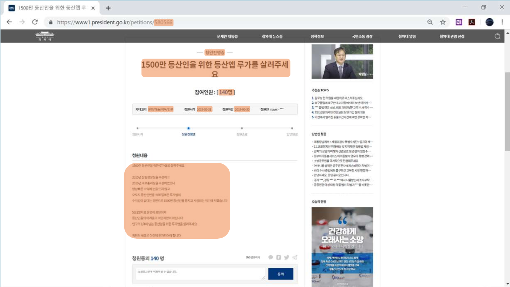

국민 청원 자연어 처리 프로젝트
=======================

*위 프로젝트는 2019년 수행된 프로젝트로 2020년에 공유되었습니다. 당시 발표 자료의 내용을 확인바랍니다.* [\[링크\]](./report/Project.pdf)

# 1. Overview

[국민 청원](https://www1.president.go.kr/petitions)은 정부와 국민의 직접 소통 창구로서, 여론을 파악하는 주요한 정보원이 됩니다. 국민 청원을 통해 사회의 다양한 문제들이 논의됩니다.

국민 청원에 있는 데이터를 텍스트 분석합니다. 국민 청원 텍스트 데이터를 바탕으로 지도 학습과 비지도 학습을 수행합니다.

국민 청원 텍스트 자동 분류 과제를 수행합니다. 청원 내용을 기반으로 청원 카테고리를 예측하는 텍스트 자동 분류 모델을 생성합니다. 

국민 청원 텍스트를 기반으로 사회 현안을 파악합니다. 국민 청원은 여타의 SNS와 다르게 사회 문제에 집중하는 유의미한 데이터입니다. 따라서 국민 청원 데이터를 토픽 모델링함으로써 주요 여론을 파악하는 데 도움이 될 수 있습니다.

# 2. Project Contents

## 1. Data Acquisition

국민 청원 데이터를 크롤링합니다. 

~~~
python A_WebCrawling.py
~~~

국민 청원의 개별 청원에는 고유번호가 있습니다. 고유번호로 구성한 ULR에 접속하여서 필요한 데이터를 수집합니다. 수집한 데이터로는 청원상태, 제목, 참여인원, 카테고리, 청원시작/종료일, 청원내용가 있습니다.

2019년 프로젝트를 위해 수집한 결과 청원 번호 579799인 4월 29일 청원부터 청원번호 559801인 3월 13일 청원까지 12,582건의 데이터가 수집되었습니다. 수집된 데이터는 CSV로 저장합니다.

|Column|Description|
|------|-----------|
|NO|청원 번호|
|TITLE|청원제목|
|COUNT|청원 참여 인원|
|STATE|청원 상태|
|CATEGORY|청원 분야|
|DATE_START/DATE_END|청원 시작일/종료일|
|CONTENT|청원 내용|

## 2. Data Preprocessing

텍스트 데이터를 전처리합니다.

텍스트 데이터 전처리를 위해서 KoNLPy 라이브러리의 Komoran 형태소 분석기를 사용합니다. Komoran 형태소 분석기에 사용자 정의 사전을 추가하고 불용어를 제거함으로써 텍스트 분석을 정교하게 만듭니다. 정제된 텍스트 중 한글 명사만을 사용해서 이후의 데이터 분석을 수행합니다.

추가한 사용자 정의 사전을 다음과 같습니다.

|단어|품사|단어|품사|
|---|---|---|---|
|가부장|NNG(일반명사)|사형제도|NNG(일반명사)|
|가부장제|NNG(일반명사)|소상공인|NNG(일반명사)|
|국민청원|NNG(일반명사)|심신미약|NNG(일반명사)|
|기간제|NNG(일반명사)|자한당|NNG(일반명사)|
|기초수급|NNG(일반명사)|적폐청산|NNG(일반명사)|
|대체복무|NNG(일반명사)|정규직|NNG(일반명사)|
|문재인|NNP(고유명사)|종북|NNG(일반명사)|
|발암물질|NNG(일반명사)|출퇴근|NNG(일반명사)|
|보이스피싱|NNG(일반명사)|포스코|NNP(고유명사)|
|불우이웃|NNG(일반명사)|혼밥|NNG(일반명사)|
|사법농단|NNG(일반명사)|||

분석에서 제거된 불용어입니다.

|불용어|불용어|불용어|불용어|
|----|----|----|-----|
|!!|때문|실상|저도|
|가나|라고|아냐|절대|
|가부|만원|요새|제가|
|경우|배로|요즘|조가|
|관련|보이|우리들의|지금|
|국민|부여|이번|천원|
|기간|부탁|인물|포스|
|니다|사람|입장|한곳|
|당장|사실|정도|해먹|
|등등|생각|자신|해주시|
|각종한글자단어|||

## 3. Exploratory Data Analysis

데이터의 공기 빈도를 분석하면서 단어 간 연관성을 파악하고 gephi로 시각화합니다. 

~~~
python B_CoWordFrequencyAnalysis.py
~~~

청원 내용의 데이터의 공기 빈도를 분석합니다. 공기 빈도를 통해 단어간의 연관성을 파악하고 이를 gephi로 시각화합니다. 또한 특정 청원 분야(정치)에 대해서 연관된 단어를 클러스터링 합니다. 클러스터링 된 결과를 바탕으로 정치개혁의 세부 청원 주제를 파악합니다.

정치개혁 분야의 1,500 건 청원에 대해서 공기 빈도를 구합니다. 단순 빈도 분석 결과는 다음과 같습니다.
 
|단어|빈도|
|---|---|
|대통령|490|
|나라|465|
|정부|334|
|국회의원|321|
|대한민국|261|
|세금|259|
|사건|257|
|부동산|253|
|장관|244|
|문재인|229|

gephi 시각화를 위해서 공기 빈도릐 결과를 graphml 형식으로 저장합니다. 6,200개의 Node와 478,108개의 Edge가 생성됩니다.

graphml 형식으로 저장된 파일을 통해서 시각화한 결과입니다. Modularity 분석 결과 크게 3 클러스터가 생성되는 것을 확인할 수 있습니다. 

|클러스터|내용|
|-----|---|
|파란색 클러스터|대통령, 정부, 국가와 같은 단어 존재. 민주주의와 관련된 내용|
|주황색 클러스터|부동산과 같은 단어 존재. 부동산 정책과 관련된 내용|
|빨간색 클러스터|사법재판소, 사형제도와 같은 단어 존재. 범죄와 관련된 내용|

분석 결과 생성된 클러스터는 토픽 모델링을 통해 생성된 주제와 비교한다.

## 4. Text Categorization

청원 내용을 기반으로 청원 분야(카테고리)를 찾는 모델을 생성합니다.

나이브 베이즈 모델
~~~
python C_ClassificatioNB.py
~~~

SVM 모델
~~~
python D_ClassificationSVM.py
~~~

데이터가 충분한 정치개혁, 안전/환경, 인권/성평등 청원 주제에 대해서 Text Classification 모델을 생성합니다. 나이브 베이즈 모델과 SVM 모델을 구현하고 이를 비교합니다.

학습 검증을 위해서는 10-fold cross validation을 사용했으며, 특정 분야에 데이터가 쏠리는 현상을 막기 위해서 최대 청원수를 조절합니다. 또한 카이 스퀘어 검정을 통해서 각 청원 주제에서 중요하게 여겨지는 단어들을 파악함으로써 분류가 제대로 이루어지고 있는지 파악합니다.

결론적으로 SVM을 사용한 텍스트 분류가 높은 정확도를 보였지만, 성능에 있어서 나이브 베이즈를 크게 상회하지는 않습니다.

## 5. Topic Modeling

토픽 모델링을 통해 정치개혁 분야의 세부 토픽을 파악합니다.

~~~
python E_TopicModeling.py
~~~

정치개혁 분야의 1,745개의 데이터를 토픽 모델링으로 분석합니다. 토픽의 수는 3, 5, 7개로 실험합니다.

토픽 3개인 경우

|Topic(3)|Labeling|Frequency|
|--------|--------|----------|
|국회의원 대통령 나라 의원 국가 정부 자유 대표|정당정치 관련 청원|719|
|부동산 세금 투기 주택 서울 공급 서민 상승|부동산 관련 청원|195|
|대통령 사건 나라 대한민국 정권 장관 수사 문재인|대통령 관련 청원|831|

토픽 5개인 경우

|Topic(5)|Labeling|Frequency|
|--------|--------|----------|
|자유 국가 의원 대통령 대한민국 정부 나라 한국당|정당정치 관련 청원|387|
|부동산 주택 투기 서울 공급 상승 서민 그린벨트|부동산 관련 청원|151|
|대통령 나라 사건 대한민국 문재인 정권 정부 수사|대통령 관련 청원|626|
|경찰 검찰 대통령 국회의원 자한당 수사 공수 사건|검/경찰 관련 청원|239|
|국회의원 세금 장관 대표 나라 여성 가족 후보자|장관 관련 청원|342|

토픽 7개인 경우

|Topic(7)|Labeling|Frequency|
|--------|--------|----------|
|자유 한국당 청원 구글 의원 정부 민주당 일본|정당정치 관련 청원|274|
|부동산 주택 서울 공급 투기 상승 그린벨트 집값|부동산 관련 청원|131|
|대통령 나라 사건 문재인 정권 대한민국 수사 정부|대통령 관련 청원|564|
|경찰 검찰 대통령 자한당 수사 정부 국내 사건|검/경찰 관련 청원|194|
|장관 후보자 나라 정부 청문회 투기 부동산 인사|장관 청문회 관련 청원|212|
|경찰 검찰 대통령 자한당 수사 정부 국내 사건|검/경찰 관련 청원|194|
|국회의원 세금 여성 대표 가족 의원 국회 비례|국회의원 관련 청원|194|
|대한민국 공수 피해자 정치인 친일파 쓰레기 의원 공개|국회의원 관련 청원|176|

분석 결과 토픽 3개인 경우 공기 빈도에 의해 형성된 클러스터링과 상당히 유사한 것을 확인할 수 있다.

# 3. Conlusion

국민 청원 데이터는 사회의 이슈를 파악하는데 있어서 주요한 데이터입니다. 하지만 특정 분야에 집중되어 있으므로 텍스트 자동화를 위해서는 모든 분야에 걸쳐서 균일한 양의 데이터가 필요할 것으로 판단됩니다.

사회적인 이슈와 긴밀하게 연결되어 있는 국민 청원은 뉴스 데이터와 연계했을 경우 분석의 정확도를 높일 수 있을 것이라고 기대합니다.